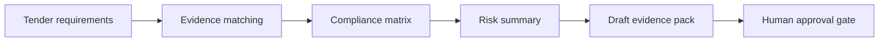

# IBRAMIND BidBox Agent

**Auditable tender-compliance intelligence with a mandatory human approval boundary.**

## Explore IBRAMIND

BidBox is one public proof inside the wider IBRAMIND Engineering Intelligence portfolio.

- **Engineering Core:** QTO / BOQ + Digital Thread
- **Project Intelligence:** Truth + Evidence + Impact + Memory + Scenarios
- **InfraRisk:** infrastructure risk intelligence
- **BidBox:** tender and procurement intelligence

Public portfolio hub: https://github.com/mohamedwoli5188-netizen/ibramind-infrarisk-ai/blob/main/PUBLIC_PORTFOLIO.md

InfraRisk repository: https://github.com/mohamedwoli5188-netizen/ibramind-infrarisk-ai

IBRAMIND BidBox Agent is a public challenge-specific prototype for the African Agentic AI Design Challenge. It converts synthetic/open tender requirements and evidence into an auditable compliance working file while preserving provenance and blocking finalization until a human reviewer approves it.

> This repository is a public technical showcase of one bounded IBRAMIND capability. It does not contain the private IBRAMIND production platform, customer procurement data, Customer OMNI, Founder OMNI, production credentials, proprietary enterprise workflows, or live tender decisions.

## IBRAMIND Engineering Intelligence

IBRAMIND is being built as a connected engineering intelligence operating system for infrastructure delivery.

The private platform spans engineering, BIM, quantity and commercial workflows, project controls, field intelligence, documents, procurement, risk, governance, and enterprise control. Its North-Star architecture connects these domains through governed project truth, evidence, relationships, impact analysis, memory, scenarios, and digital-twin views.

A simplified public capability map is:

```
Drawings / BIM / Documents
          ↓
Engineering Graph / Digital Thread
          ↓
QTO → BOQ → Measurement → IPC
          ↓
Variation / Claim / Procurement / Cost
          ↓
Commercial & Project Intelligence
          ↓
Evidence → Truth State → Change Impact
          ↓
Connected Search → Engineering Memory → Scenarios
          ↓
Human Review / Governed Action
```

This repository demonstrates the **tender/procurement-intelligence** part of that wider architecture without publishing the private production implementation.

See [IBRAMIND_PLATFORM.md](IBRAMIND_PLATFORM.md) for the safe public architecture overview.

## IBRAMIND public portfolio

BidBox is one bounded public showcase inside the wider IBRAMIND Engineering Intelligence portfolio.

The public portfolio also includes engineering-core QTO/BOQ + Digital Thread and Project Intelligence demonstrations in the InfraRisk showcase repository.

Public portfolio hub: https://github.com/mohamedwoli5188-netizen/ibramind-infrarisk-ai/blob/main/PUBLIC_PORTFOLIO.md

## Problem

Procurement and engineering teams often review tender requirements, BOQs, supplier evidence, and technical schedules across disconnected files. Mandatory requirements can be missed, provenance can be difficult to trace, and evaluation working files can become inconsistent.

## What BidBox demonstrates

- Requirement → evidence matching
- Compliance matrix generation
- Unresolved-risk flagging
- Evidence provenance
- Draft evaluation evidence packs
- MCP JSON-RPC tools over stdio
- Bounded multi-step agent orchestration
- Human-in-the-loop finalization
- Synthetic/open data only

The prototype **does not award a tender or choose a bidder**.

## Commercial use / paid pilots

The public repository is the demonstrator. IBRAMIND can provide paid pilots and enterprise deployments for tender review, compliance matrices, BOQ/document extraction, procurement evidence, auditability, integrations, and governed agent workflows.

**Request a paid pilot:** https://ibramind.com  
**Founder / partnership contact:** founder@ibramind.com

See [COMMERCIAL.md](COMMERCIAL.md) for the commercial boundary.

## 30-second demo

Run the bundled synthetic tender:

```bash
./run_demo.sh
```

The fixture contains four requirements. Bid-security evidence is intentionally missing while registration, methodology, and experience evidence are present. The demo is designed to surface the unresolved mandatory requirement instead of inventing evidence or autonomously finalizing an award decision.



## Where this becomes commercial

Typical paid-pilot scopes include a defined tender package, document set, evaluation workflow, compliance rules, evidence provenance requirements, and human approval controls. Success is measured with observable criteria such as requirement coverage, evidence traceability, unresolved-risk detection, auditability, reviewer usefulness, and workflow fit.

See [PILOT.md](PILOT.md) for a sample engagement structure.

## Target users

Public-procurement teams, evaluation committees, contractors, consultants, infrastructure owners, auditors, and institutional procurement organizations.

## Architecture

```
Human Reviewer
      ↓
Agent Planner
      ↓
MCP Client
      ↓
BidBox MCP Server
      ↓
Compliance Matrix
      ↓
Risk Summary
      ↓
Draft Evidence Pack
      ↓
Human Approval Gate
```

See `ARCHITECTURE.md` and `docs/architecture.svg.png`.

## MCP tools

The challenge-specific server exposes four bounded tools:

- `load_tender`
- `build_compliance_matrix`
- `summarize_risks`
- `prepare_draft_pack`

`bidbox/server.py` is the MCP server. `bidbox/agent.py` is the client/orchestrator. The public demo accepts only `SYN-*` tender IDs.

## Human approval boundary

`FINALIZE_EVALUATION` is blocked by default. Generated packs record:

- `required: true`
- `approved: false`
- `blocked_action: FINALIZE_EVALUATION`

Human reviewers remain accountable for procurement decisions.

## Setup

Requires Python 3.10+ for the default demo. No third-party packages are required.

```bash
git clone https://github.com/mohamedwoli5188-netizen/ibramind-bidbox-agent.git
cd ibramind-bidbox-agent
./run_demo.sh
```

Optional open-weights planning mode expects a local Ollama-compatible endpoint and model.

## Technical evidence

`tests/test_demo.py` contains evaluation cases including an intentional expected failure showing that missing mandatory bid-security evidence is surfaced rather than fabricated.

## Live demo

https://mohamedwoli5188-netizen.github.io/ibramind-bidbox-agent/

## Public/private boundary

Public here:
- Challenge-specific bounded agent
- Synthetic/open fixture data
- Public architecture/demo artifacts
- Reproducible evaluation evidence
- Safe public description of the wider IBRAMIND architecture

Kept private:
- Live procurement/customer data
- Production IBRAMIND platform
- Customer OMNI and Founder OMNI implementation
- Project Truth, Digital Thread, Evidence Passport, Engineering Memory, Scenario Engine and Digital Twin production internals
- Proprietary enterprise workflows and integrations
- Production credentials, infrastructure and commercial deployment configuration

## Limitations

This public challenge demo uses a small synthetic fixture and does not connect to live procurement systems, supplier databases, or live tender decisions. It is not a substitute for legal, procurement, engineering, or evaluation-committee judgment.

## Security

See [SECURITY.md](SECURITY.md). Do not report credentials, vulnerabilities, or sensitive procurement information in public issues.

## License and brand

Prototype source code is licensed under the [MIT License](LICENSE). IBRAMIND names, logos, trademarks, private platform code, customer data, and commercial services are not granted by that license. See [TRADEMARK.md](TRADEMARK.md).

---

Built by **IBRAMIND Engineering Intelligence** — connected, governed engineering, commercial, procurement, and project intelligence.
